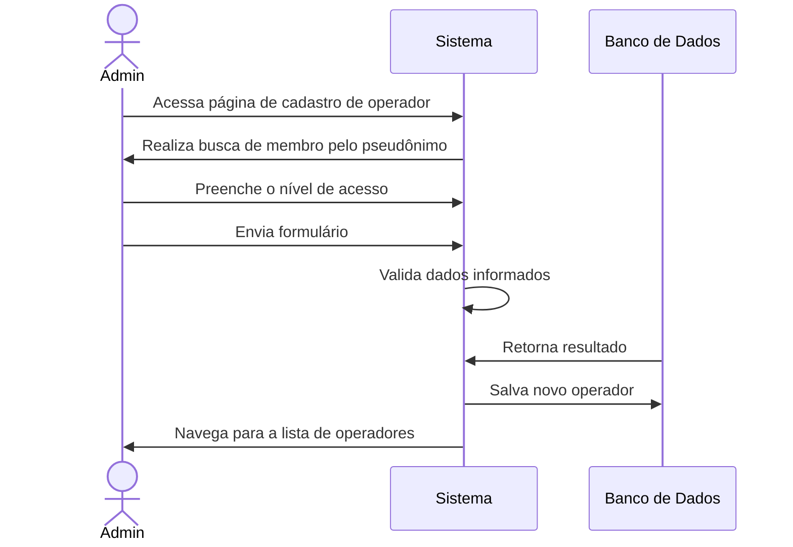

# 👤 RF01 - Cadastrar Operador

{ width=150 }

## 📝 Descrição

 Esta funcionalidade permite que o administrador promova um membro a operador do sistema.

## 👑 Atores

- Administrador do sistema

## ⚠️ Pré-condições

- O administrador deve estar autenticado no sistema.

## 🔌 Endpoints

- `POST /quilombo-api/user`

## 📋 Dados do Operador

| Campo             | Tipo     | Obrigatório | Descrição        | Restrições             |
|-------------------|----------|-------------|------------------|------------------------|
| `psedonimo`       | `string` | ✅ Sim       | Nome do operador | Mínimo de 3 caracteres |
| `nivel de acesso` | `string` | ✅ Sim       | Tipo de acesso   | "ADMIN" ou "OPERATOR"  |

## 🔄 Fluxo Principal



1. Inicialmente, o admin acessa a página de cadastro de operador.
2. O sistema exibe um formulário de cadastro com os campos a serem preenchidos.
3. O admin preenche os campos obrigatórios do formulário.
4. O admin envia o formulário de cadastro.
5. O sistema valida os dados informados.
6. O sistema cria uma conta de operador com os dados fornecidos.
7. O sistema navega para a lista de operadores cadastrados.

## 🔀 Fluxos Alternativos

### ⚠️ F02 - Dados inválidos

1. No passo 5 do fluxo principal, se os dados informados forem inválidos, o sistema exibe uma mensagem de erro.
2. O sistema retorna ao passo 3 do fluxo principal para que o admin corrija os dados informados.

## 🧪 Exemplos de Uso

### Requisição HTTP
```http
POST /quilombo-api/user HTTP/1.1
Host: api.quilombopenabranca.org
Content-Type: application/json
Authorization: Bearer {token}

{
  "pkMember": 1,
  "permissionUser": "ADMIN_MASTER"
}
```


## 🖼️ Interface de Referência


---


> ---------------------------------------------------------------------------
> #### 🌙 Quilombo Pena Branca 🌙
> ***Honrando nossas raízes, construindo nosso futuro***
> ---------------------------------------------------------------------------
