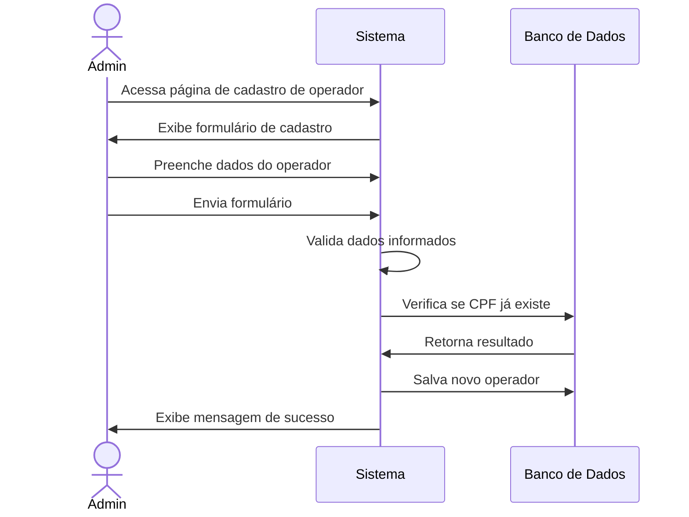
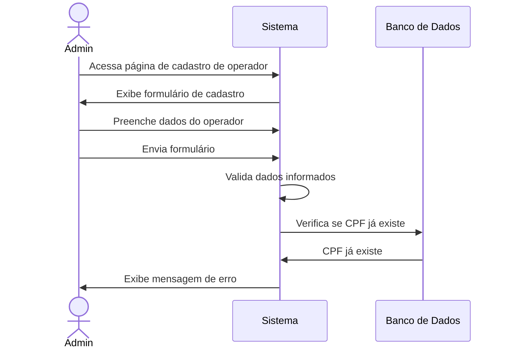

# 👤 RF01 - Cadastrar Operador

{ width=150 }

## 📝 Descrição

- Esta funcionalidade permite que o administrador crie um operador no sistema.

## 👑 Atores

- Administrador do sistema

## ⚠️ Pré-condições

- O administrador deve estar autenticado no sistema.
- O CPF informado não pode estar registrado para outro operador.

## 🔌 Endpoints

- `POST /api/v1/users`

## 📋 Dados

| Campo      | Tipo     | Obrigatório | Descrição         | Restrições                      |
|------------|----------|-------------|-------------------|---------------------------------|
| `name`     | `string` | ✅ Sim       | Nome do operador  | Mínimo de 3 caracteres          |
| `cpf`      | `string` | ✅ Sim       | CPF do operador   | Formato válido (999.999.999-99) |
| `password` | `string` | ✅ Sim       | Senha do operador | Mínimo de 8 caracteres          |

## 🔄 Fluxo Principal



1. Inicialmente, o admin acessa a página de cadastro de operador.
2. O sistema exibe um formulário de cadastro com os campos a serem preenchidos.
3. O admin preenche os campos obrigatórios do formulário.
4. O admin envia o formulário de cadastro.
5. O sistema valida os dados informados.
6. O sistema cria uma conta de operador com os dados fornecidos.
7. O sistema exibe uma mensagem de confirmação de cadastro.

## 🔀 Fluxos Alternativos

### ⚠️ F01 - CPF já cadastrado



1. Inicialmente, o admin acessa a página de cadastro de operador.
2. O sistema exibe um formulário de cadastro com os campos a serem preenchidos.
3. O admin preenche os campos obrigatórios do formulário.
4. O admin envia o formulário de cadastro.
5. O sistema valida os dados informados.
6. O sistema exibe uma mensagem de erro informando que o CPF já está cadastrado.
7. O sistema retorna ao passo 2 do fluxo principal para que o admin corrija os dados informados.


### ⚠️ F02 - Dados inválidos

1. No passo 5 do fluxo principal, se os dados informados forem inválidos, o sistema exibe uma mensagem de erro.
2. O sistema retorna ao passo 2 do fluxo principal para que o admin corrija os dados informados.

## 🧪 Exemplos de Uso

### Requisição HTTP
```http
POST /api/v1/users HTTP/1.1
Host: api.quilombopenabranca.org
Content-Type: application/json
Authorization: Bearer {token}

{
  "name": "João da Silva",
  "cpf": "123.456.789-01",
  "password": "senha@123"
}
```

### Resposta de Sucesso
```http
HTTP/1.1 201 Created
Content-Type: application/json

{
  "id": 1,
  "name": "João da Silva",
  "cpf": "123.456.789-01",
  "createdAt": "2023-05-15T10:30:45Z"
}
```

---

  #### 🌙 Quilombo Pena Branca 🌙
  ***Honrando nossas raízes, construindo nosso futuro***

