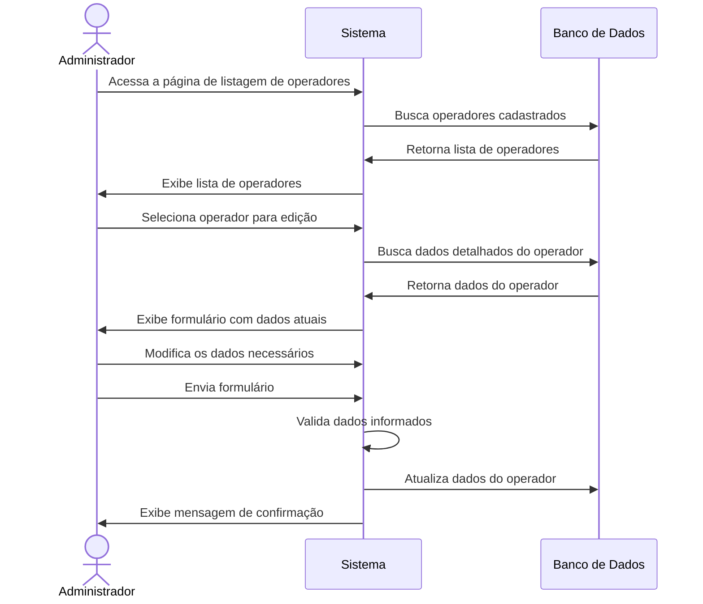
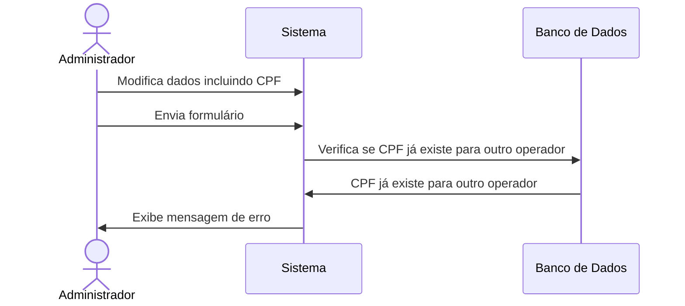

# ✏️ RF02 - Editar Operador

{ width=150 }

## 📝 Descrição

Esta funcionalidade permite que o administrador atualize os dados de um operador já cadastrado no sistema Quilombo Pena Branca, garantindo que as informações de acesso estejam sempre corretas e atualizadas.

## 👑 Atores

- Administrador do sistema

## ⚠️ Pré-condições

- O administrador deve estar autenticado no sistema
- O operador a ser editado deve estar cadastrado no sistema
- O CPF não pode ser alterado para um CPF já cadastrado para outro operador

## 🔌 Endpoints

- `PUT /api/v1/users/{id}`

## 📋 Dados do Operador

| Campo      | Tipo     | Obrigatório | Descrição             | Restrições                      |
|------------|----------|-------------|----------------------|----------------------------------|
| `name`     | `string` | ✅ Sim      | Nome do operador      | Mínimo de 3 caracteres          |
| `cpf`      | `string` | ✅ Sim      | CPF do operador       | Formato válido (999.999.999-99) |
| `password` | `string` | ❌ Não      | Nova senha do operador| Mínimo de 8 caracteres          |
| `isAdmin`  | `boolean`| ✅ Sim      | Se é administrador    | true/false                      |
| `status`   | `string` | ✅ Sim      | Status do operador    | "ACTIVE" ou "INACTIVE"          |

## 🔄 Fluxo Principal



1. O administrador acessa a página de listagem de operadores.
2. O sistema exibe a lista de operadores cadastrados.
3. O administrador seleciona o operador que deseja editar.
4. O sistema exibe um formulário preenchido com os dados atuais do operador.
5. O administrador modifica os campos necessários.
6. O administrador envia o formulário com as alterações.
7. O sistema valida os dados informados.
8. O sistema atualiza os dados do operador.
9. O sistema exibe uma mensagem de confirmação da atualização.

## 🔀 Fluxos Alternativos

### ⚠️ F01 - CPF alterado para um já existente



1. No passo 5 do fluxo principal, o administrador altera o CPF do operador.
2. O administrador envia o formulário com as alterações.
3. O sistema verifica que o CPF já está cadastrado para outro operador.
4. O sistema exibe uma mensagem de erro informando que o CPF já está em uso.
5. O sistema mantém os dados já preenchidos para correção.

### ⚠️ F02 - Operador não encontrado

1. No passo 3 do fluxo principal, o sistema não encontra o operador solicitado.
2. O sistema exibe uma mensagem informando que o operador não foi encontrado.
3. O sistema redireciona o administrador para a página de listagem de operadores.

### ⚠️ F03 - Dados inválidos

1. No passo 7 do fluxo principal, o sistema identifica dados inválidos (formato incorreto, campos obrigatórios em branco).
2. O sistema exibe mensagens específicas para cada erro encontrado.
3. O sistema mantém os dados já preenchidos para correção.

## 🧪 Exemplo de Requisição

### Requisição HTTP
```http
PUT /api/v1/users/42 HTTP/1.1
Host: api.quilombopenabranca.org
Content-Type: application/json
Authorization: Bearer {token}

{
  "name": "João da Silva Santos",
  "cpf": "123.456.789-01",
  "password": "novasenha@123",
  "isAdmin": false,
  "status": "ACTIVE"
}
```

### Resposta de Sucesso
```http
HTTP/1.1 200 OK
Content-Type: application/json

{
  "id": 42,
  "name": "João da Silva Santos",
  "cpf": "123.456.789-01",
  "isAdmin": false,
  "status": "ACTIVE",
  "updatedAt": "2023-06-20T09:15:30Z"
}
```

## 🖼️ Interface de Referência


## 🔐 Considerações de Segurança

- A senha só é atualizada se o campo for preenchido
- Não é possível visualizar a senha atual do operador
- Somente administradores podem editar outros operadores
- Um operador pode editar seus próprios dados, exceto o campo `isAdmin`
- Todas as alterações são registradas no log do sistema para auditoria

---

  #### 🌙 Quilombo Pena Branca 🌙
  ***Honrando nossas raízes, construindo nosso futuro***