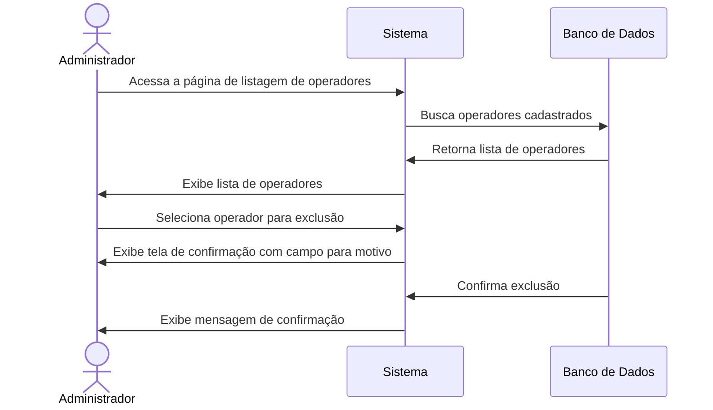
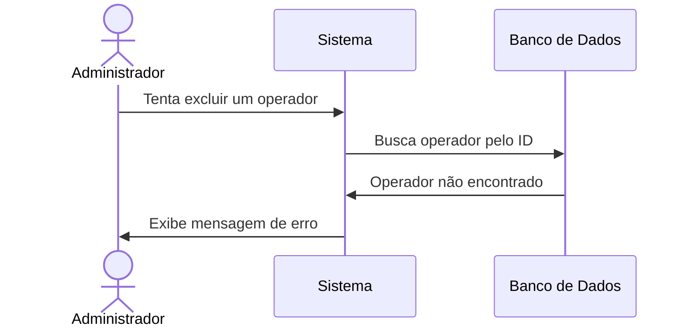
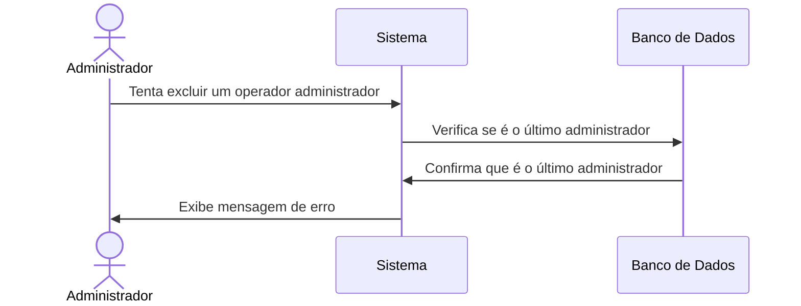

# 🗑️ RF03 - Excluir Operador

{ width=150 }

## 📝 Descrição

Esta funcionalidade permite que o administrador desative ou exclua um operador do sistema Quilombo Pena Branca, impedindo seu acesso ao sistema quando necessário, por exemplo, em caso de desligamento.

## 👑 Atores

- Administrador do sistema

## ⚠️ Pré-condições

- O administrador deve estar autenticado no sistema
- O operador a ser excluído deve estar cadastrado no sistema
- O administrador não pode excluir sua própria conta
- Deve haver pelo menos um administrador ativo no sistema

## 🔌 Endpoints

- `DELETE /quilombo-api/user/{id}`

## 📋 Dados para Exclusão

| Campo        | Tipo      | Obrigatório | Descrição                 | Restrições              |
|--------------|-----------|-------------|---------------------------|-------------------------|
| `id`         | `integer` | ✅ Sim       | ID do operador a excluir  | Deve existir no sistema |

## 🔄 Fluxo Principal



1. O administrador acessa a página de listagem de operadores.
2. O sistema exibe a lista de operadores cadastrados.
3. O administrador seleciona o operador que deseja excluir.
4. O sistema exibe uma tela de confirmação com campo para informar o motivo da exclusão.
5. O administrador preenche o motivo e confirma a exclusão.
6. O sistema valida os dados e verifica as regras de negócio (não pode excluir o último administrador).
7. O sistema marca o operador como inativo (exclusão lógica).
8. O sistema exibe uma mensagem de confirmação da exclusão.

## 🔀 Fluxos Alternativos

### ⚠️ F01 - Operador não encontrado



1. No passo 3 do fluxo principal, o sistema verifica que o operador não existe.
2. O sistema exibe uma mensagem informando que o operador não foi encontrado.
3. O sistema mantém o administrador na página de listagem de operadores.

### ⚠️ F02 - Tentativa de excluir o último administrador



1. No passo 6 do fluxo principal, o sistema verifica que o operador é o último administrador.
2. O sistema exibe uma mensagem informando que não é possível excluir o último administrador.
3. A operação é cancelada.

### ⚠️ F03 - Tentativa de excluir a própria conta

1. No passo 5 do fluxo principal, o sistema verifica que o administrador está tentando excluir sua própria conta.
2. O sistema exibe uma mensagem informando que não é possível excluir a própria conta.
3. A operação é cancelada.

## 🧪 Exemplo de Requisição

### Requisição HTTP
```http
DELETE /quilombo-api/user/42 HTTP/1.1
Host: api.quilombopenabranca.org
Content-Type: application/json
Authorization: Bearer {token}

```

### Resposta de Sucesso
```http
HTTP/1.1 200 OK
Content-Type: application/json

{
  "message": "Operador excluído com sucesso",
  "deletedAt": "2023-06-20T09:15:30Z"
}
```

## 🖼️ Interface de Confirmação


## ⚠️ Impactos da Exclusão

Quando um operador é excluído do sistema:

- 🚫 Não pode mais realizar login no sistema
- 📝 Seu registro permanece no banco de dados para fins de auditoria (exclusão lógica)
- 🔄 Pode ser reativado posteriormente por um administrador, se necessário
- 📊 Suas ações passadas permanecem registradas nos logs do sistema
- 👤 Seu nome continua aparecendo nos registros de atividades realizadas anteriormente

## 🔐 Considerações de Segurança

- Por padrão, a exclusão é lógica (softDelete = true)
- Para exclusão física (remoção do banco de dados), é necessário acesso direto ao banco
- Todas as tentativas de exclusão são registradas no log do sistema
- A exclusão de um operador não afeta os dados de membros cadastrados por ele

---


> ---------------------------------------------------------------------------
> #### 🌙 Quilombo Pena Branca 🌙
> ***Honrando nossas raízes, construindo nosso futuro***
> ---------------------------------------------------------------------------