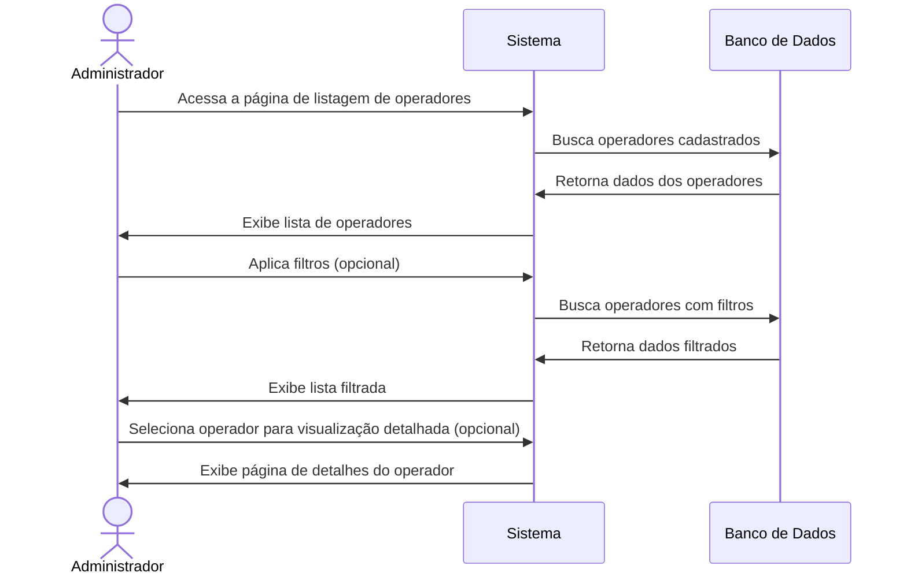
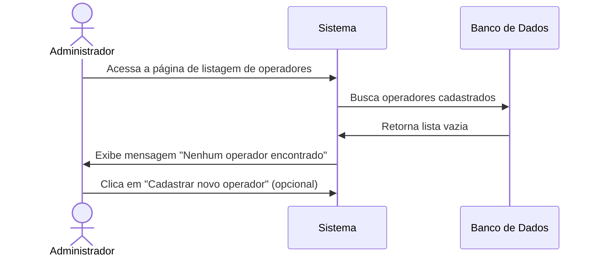

# 📋 RF04 - Listar Operadores

{ width=150 }

## 📝 Descrição

Esta funcionalidade permite que o administrador visualize todos os operadores cadastrados no sistema Quilombo Pena Branca, facilitando a gestão de acessos e permissões.

## 👑 Atores

- Administrador do sistema
- Operador

## ⚠️ Pré-condições

- O usuário deve estar autenticado no sistema

## 🔌 Endpoints

- `GET /quilombo-api/user`

## 📋 Parâmetros de Consulta

| Campo     | Tipo      | Obrigatório | Descrição                      | Exemplo            |
|-----------|-----------|-------------|--------------------------------|--------------------|
| `name`    | `string`  | ❌ Não       | Nome para filtrar operadores   | `?name=Silva`      |
| `status`  | `string`  | ❌ Não       | Status do operador             | `?status=OPERADOR` |
| `page`    | `integer` | ❌ Não       | Página da listagem             | `?page=1`          |
| `size`    | `integer` | ❌ Não       | Quantidade de itens por página | `?size=20`         |

## 🔄 Fluxo Principal



1. O administrador acessa a página de listagem de operadores.
2. O sistema exibe uma tabela com todos os operadores cadastrados, exibindo informações resumidas.
3. O administrador pode filtrar a lista por nome, CPF ou status.
4. O administrador pode ordenar a lista por diferentes campos (nome, data de cadastro, etc.).
5. O administrador pode navegar entre as páginas da listagem.
6. O administrador pode selecionar um operador específico para:
   - Visualizar detalhes completos
   - Editar informações
   - Desativar/excluir o operador
7. O administrador pode adicionar um novo operador a partir da lista.

## 🔀 Fluxos Alternativos

### ⚠️ F01 - Nenhum operador encontrado



1. No passo 2 do fluxo principal, o sistema não encontra nenhum operador cadastrado.
2. O sistema exibe uma mensagem informando que não há operadores cadastrados.
3. O sistema oferece a opção de cadastrar um novo operador.

### ⚠️ F02 - Nenhum resultado para os filtros aplicados

1. No passo 3 do fluxo principal, o administrador aplica filtros que não retornam resultados.
2. O sistema exibe uma mensagem informando que nenhum operador foi encontrado com os filtros aplicados.
3. O sistema oferece a opção de limpar os filtros.

## 📊 Resposta da API

### Resposta de Sucesso
```http
HTTP/1.1 200 OK
Content-Type: application/json

{
  "content": [
    {
      "pkUser": 1,
      "nameUser": "Maria Administradora",
      "permissionUser": "ADMIN",
    },
    {
      "pkUserpkUser": 2,
      "nameUsernameUser": "João Operador",
      "permissionUser": "OPERATOR",
    }
    // ... mais operadores
  ],
  "pageable": {
    "pageNumber": 0,
    "pageSize": 7,
    "totalElements": 15,
    "totalPages": 3
  }
}
```

## 🖼️ Interface da Listagem


## 🔍 Recursos da Interface

- **🔍 Barra de busca** para pesquisas rápidas por nome 
- **⚙️ Filtros avançados** com opções para refinar a busca
- **🔢 Paginação** com opções para definir itens por página
- **🎨 Indicadores visuais** para status de operador (ativo/inativo)
- **👑 Ícone especial** para identificar administradores
- **📝 Ações rápidas** para editar ou excluir operadores

## 🔐 Informações Exibidas

Para cada operador, são exibidas as seguintes informações:

| Informação | Descrição                                            |
|------------|------------------------------------------------------|
| 👤 Nome    | Nome completo do operador                            |
| 👑 Tipo    | Se é administrador ou operador padrão                |
| ⚙️ Ações   | Botões para visualizar, editar ou excluir o operador |

---

> ---------------------------------------
> #### 🌙 Quilombo Pena Branca 🌙
> ***Honrando nossas raízes, construindo nosso futuro***
> ---------------------------------------
