# 📋 RF04 - Listar Operadores

{ width=150 }

## 📝 Descrição

Esta funcionalidade permite que o administrador visualize todos os operadores cadastrados no sistema Quilombo Pena Branca, facilitando a gestão de acessos e permissões.

## 👑 Atores

- Administrador do sistema

## ⚠️ Pré-condições

- O administrador deve estar autenticado no sistema
- O usuário deve possuir permissões de administrador

## 🔌 Endpoints

- `GET /api/v1/users`

## 📋 Parâmetros de Consulta

| Campo        | Tipo     | Obrigatório | Descrição                     | Exemplo               |
|--------------|----------|-------------|-------------------------------|------------------------|
| `name`       | `string` | ❌ Não      | Nome para filtrar operadores  | `?name=Silva`         |
| `cpf`        | `string` | ❌ Não      | CPF para busca específica     | `?cpf=123.456.789-01` |
| `status`     | `string` | ❌ Não      | Status do operador            | `?status=ACTIVE`      |
| `isAdmin`    | `boolean`| ❌ Não      | Se é administrador ou não     | `?isAdmin=true`       |
| `page`       | `integer`| ❌ Não      | Página da listagem            | `?page=1`             |
| `size`       | `integer`| ❌ Não      | Quantidade de itens por página| `?size=20`            |
| `sort`       | `string` | ❌ Não      | Campo e direção de ordenação  | `?sort=name,asc`      |

## 🔄 Fluxo Principal

```mermaid
sequenceDiagram
    actor A as Administrador
    participant S as Sistema
    participant BD as Banco de Dados
    
    A->>S: Acessa a página de listagem de operadores
    S->>BD: Busca operadores cadastrados
    BD->>S: Retorna dados dos operadores
    S->>A: Exibe lista de operadores
    A->>S: Aplica filtros (opcional)
    S->>BD: Busca operadores com filtros
    BD->>S: Retorna dados filtrados
    S->>A: Exibe lista filtrada
    A->>S: Seleciona operador para visualização detalhada (opcional)
    S->>A: Exibe página de detalhes do operador
```



1. O administrador acessa a página de listagem de operadores.
2. O sistema exibe uma tabela com todos os operadores cadastrados, exibindo informações resumidas.
3. O administrador pode filtrar a lista por nome, CPF ou status.
4. O administrador pode ordenar a lista por diferentes campos (nome, data de cadastro, etc.).
5. O administrador pode navegar entre as páginas da listagem.
6. O administrador pode selecionar um operador específico para:
   - Visualizar detalhes completos
   - Editar informações
   - Desativar/excluir o operador
7. O administrador pode adicionar um novo operador a partir da lista.

## 🔀 Fluxos Alternativos

### ⚠️ F01 - Nenhum operador encontrado

```mermaid
sequenceDiagram
    actor A as Administrador
    participant S as Sistema
    participant BD as Banco de Dados
    
    A->>S: Acessa a página de listagem de operadores
    S->>BD: Busca operadores cadastrados
    BD->>S: Retorna lista vazia
    S->>A: Exibe mensagem "Nenhum operador encontrado"
    A->>S: Clica em "Cadastrar novo operador" (opcional)
```



1. No passo 2 do fluxo principal, o sistema não encontra nenhum operador cadastrado.
2. O sistema exibe uma mensagem informando que não há operadores cadastrados.
3. O sistema oferece a opção de cadastrar um novo operador.

### ⚠️ F02 - Nenhum resultado para os filtros aplicados

1. No passo 3 do fluxo principal, o administrador aplica filtros que não retornam resultados.
2. O sistema exibe uma mensagem informando que nenhum operador foi encontrado com os filtros aplicados.
3. O sistema oferece a opção de limpar os filtros.

## 📊 Resposta da API

### Resposta de Sucesso
```http
HTTP/1.1 200 OK
Content-Type: application/json

{
  "content": [
    {
      "id": 1,
      "name": "Maria Administradora",
      "cpf": "123.456.789-01",
      "status": "ACTIVE",
      "isAdmin": true,
      "createdAt": "2023-01-15T10:30:00Z",
      "lastLogin": "2023-06-19T08:45:30Z"
    },
    {
      "id": 2,
      "name": "João Operador",
      "cpf": "987.654.321-00",
      "status": "ACTIVE",
      "isAdmin": false,
      "createdAt": "2023-02-20T14:15:00Z",
      "lastLogin": "2023-06-18T16:22:10Z"
    }
    // ... mais operadores
  ],
  "pageable": {
    "pageNumber": 0,
    "pageSize": 20,
    "totalElements": 15,
    "totalPages": 1
  }
}
```

## 🖼️ Interface da Listagem


## 🔍 Recursos da Interface

- **🔍 Barra de busca** para pesquisas rápidas por nome ou CPF
- **⚙️ Filtros avançados** com opções para refinar a busca
- **📊 Ordenação** por colunas clicáveis
- **🔢 Paginação** com opções para definir itens por página
- **🎨 Indicadores visuais** para status de operador (ativo/inativo)
- **👑 Ícone especial** para identificar administradores
- **➕ Botão de adição** para cadastrar novos operadores
- **📝 Ações rápidas** para editar ou excluir operadores

## 🔐 Informações Exibidas

Para cada operador, são exibidas as seguintes informações:

| Informação         | Descrição                                           |
|--------------------|-----------------------------------------------------|
| 👤 Nome            | Nome completo do operador                           |
| 🆔 CPF             | CPF do operador (parcialmente mascarado)            |
| 👑 Tipo            | Se é administrador ou operador padrão               |
| 🔴/🟢 Status       | Status atual (ativo ou inativo)                     |
| 📅 Data de cadastro| Data em que o operador foi cadastrado               |
| 🕒 Último acesso   | Data e hora do último login no sistema              |
| ⚙️ Ações           | Botões para visualizar, editar ou excluir o operador|

---

  #### 🌙 Quilombo Pena Branca 🌙
  ***Honrando nossas raízes, construindo nosso futuro***