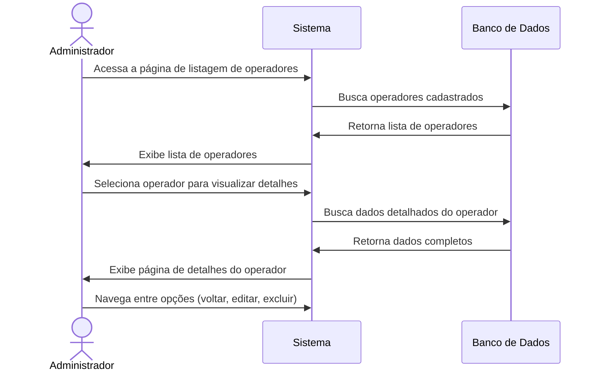
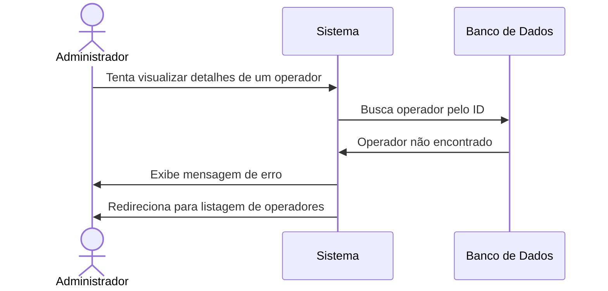

# 🔍 RF05 - Detalhar Operador

{ width=150 }

## 📝 Descrição

Esta funcionalidade permite que o administrador visualize informações detalhadas sobre um operador específico no sistema Quilombo Pena Branca, facilitando a gestão de usuários e o controle de acesso.

## 👑 Atores

- Administrador do sistema
- Operador

## ⚠️ Pré-condições

- O usuário deve estar autenticado no sistema
- O operador a ser detalhado deve estar cadastrado no sistema
- Um operador não-administrador só pode visualizar seus próprios detalhes

## 🔌 Endpoints

- `GET /api/v1/users/{id}`

## 📋 Dados do Operador

| Campo          | Tipo      | Descrição                       | Observações                         |
|----------------|-----------|---------------------------------|-------------------------------------|
| `id`           | `integer` | ID do operador                  | Identificador único                 |
| `name`         | `string`  | Nome completo do operador       | -                                   |
| `cpf`          | `string`  | CPF do operador                 | Formato: 999.999.999-99             |
| `isAdmin`      | `boolean` | Se o operador é administrador   | true/false                          |
| `status`       | `string`  | Status do operador              | "ACTIVE" ou "INACTIVE"              |
| `createdAt`    | `date`    | Data de criação do operador     | Formato ISO 8601                    |
| `updatedAt`    | `date`    | Data da última atualização      | Formato ISO 8601                    |
| `lastLogin`    | `date`    | Data do último acesso           | Formato ISO 8601                    |
| `createdBy`    | `string`  | Nome de quem criou o registro   | Pode ser null para o primeiro admin |
| `activityLogs` | `array`   | Registro de atividades recentes | Últimas 10 atividades               |

## 🔄 Fluxo Principal



1. O administrador acessa a página de listagem de operadores.
2. O sistema exibe a lista de operadores cadastrados.
3. O administrador seleciona o operador específico que deseja visualizar.
4. O sistema busca e exibe todas as informações detalhadas sobre o operador selecionado.
5. O administrador visualiza os dados do operador, incluindo:
   - Informações pessoais (nome, CPF)
   - Informações de acesso (status, tipo de usuário)
   - Estatísticas de uso (data do último acesso, atividades recentes)
   - Histórico de alterações (data de criação, última atualização)
6. O administrador pode realizar as seguintes ações:
   - Voltar para a listagem de operadores
   - Editar os dados do operador
   - Desativar/excluir o operador

## 🔀 Fluxos Alternativos

### ⚠️ F01 - Operador não encontrado



1. No passo 4 do fluxo principal, o sistema não encontra o operador solicitado.
2. O sistema exibe uma mensagem informando que o operador não foi encontrado.
3. O sistema redireciona o usuário para a página de listagem de operadores.

### ⚠️ F02 - Acesso não autorizado

1. Um operador sem privilégios de administrador tenta acessar os detalhes de outro operador.
2. O sistema verifica que o usuário não tem permissão para esta ação.
3. O sistema exibe uma mensagem de acesso não autorizado.
4. O sistema redireciona o usuário para a página inicial.

## 🧪 Exemplo de Resposta da API

```http
HTTP/1.1 200 OK
Content-Type: application/json

{
  "id": 42,
  "name": "João da Silva Santos",
  "cpf": "123.456.789-01",
  "isAdmin": false,
  "status": "ACTIVE",
  "createdAt": "2023-01-15T10:30:00Z",
  "updatedAt": "2023-06-20T09:15:30Z",
  "lastLogin": "2023-06-22T14:25:45Z",
  "createdBy": "Maria Administradora",
  "activityLogs": [
    {
      "action": "LOGIN",
      "timestamp": "2023-06-22T14:25:45Z",
      "details": "Login bem-sucedido"
    },
    {
      "action": "MEMBER_UPDATE",
      "timestamp": "2023-06-21T11:10:22Z",
      "details": "Atualização do membro ID 15"
    },
    {
      "action": "MEMBER_CREATE",
      "timestamp": "2023-06-20T16:35:12Z",
      "details": "Criação do membro ID 28"
    }
    // ... mais atividades
  ]
}
```

## 🖼️ Interface de Visualização


## 📊 Seções da Interface

### 👤 Informações Pessoais
- Nome completo
- CPF (parcialmente mascarado para segurança)
- Tipo de usuário (Administrador/Operador)
- Status atual (Ativo/Inativo)

### 📆 Datas Importantes
- Data de criação da conta
- Data da última atualização
- Data e hora do último acesso

### 📝 Atividades Recentes
Tabela das últimas ações realizadas pelo operador, incluindo:
- Tipo de ação (login, criação de membro, etc.)
- Data e hora da ação
- Detalhes adicionais sobre a ação

### ⚙️ Ações Disponíveis
- Botão para editar dados do operador
- Botão para desativar/excluir operador
- Botão para voltar à listagem

## 🔐 Considerações de Segurança

- Dados sensíveis como senhas nunca são exibidos
- CPF é parcialmente mascarado na interface
- Log de visualização é mantido para fins de auditoria
- Acesso às informações é controlado por permissões de usuário

---

  #### 🌙 Quilombo Pena Branca 🌙
  ***Honrando nossas raízes, construindo nosso futuro***
```

---
# Requisitos
## Requisitos Funcionais

| Cod. | Nome               | Ator     | Objetivo                                            |
|------|--------------------|----------|-----------------------------------------------------|