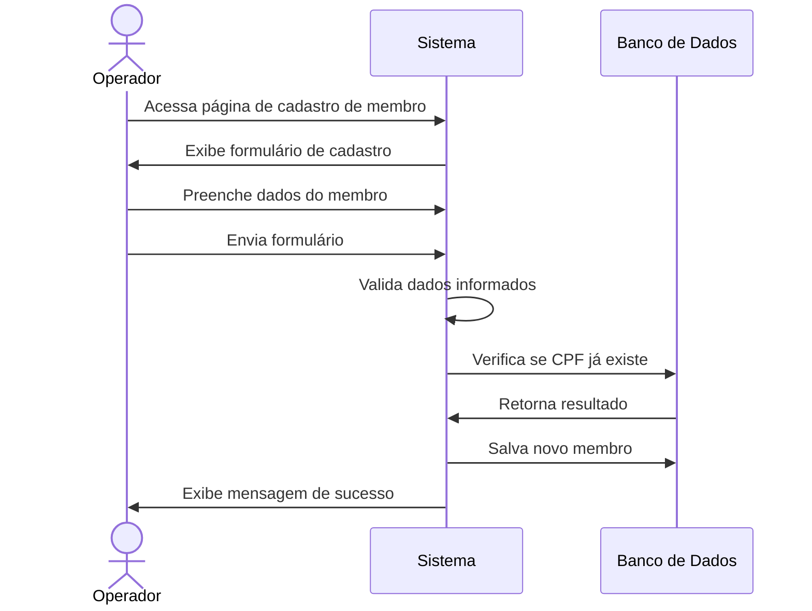
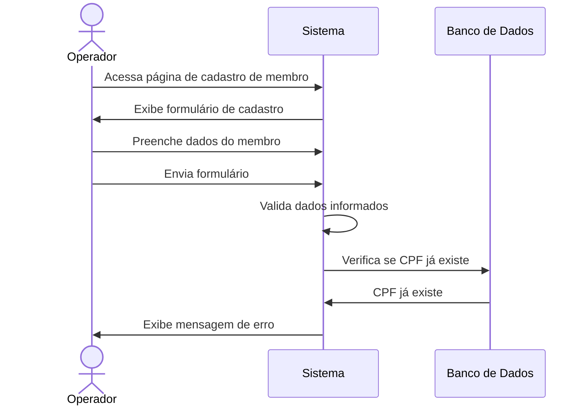

# 👥 RF06 - Cadastrar Membro

{ width=150 }

## 📝 Descrição

Esta funcionalidade permite que o operador cadastre um novo membro no sistema Quilombo Pena Branca, registrando tanto informações pessoais quanto espirituais.

## 👑 Atores

- Administrador do sistema
- Operador

## ⚠️ Pré-condições

- O operador deve estar autenticado no sistema
- O CPF informado não pode estar registrado para outro membro

## 🔌 Endpoints

- `POST /api/v1/members`

## 📋 Dados do Membro

| Campo              | Tipo      | Obrigatório | Descrição                                    | Restrições                      |
|--------------------|-----------|-------------|----------------------------------------------|---------------------------------|
| `name`             | `string`  | ✅ Sim       | Nome completo do membro                      | Mínimo de 3 caracteres          |
| `email`            | `string`  | ✅ Sim       | E-mail do membro                             | Formato válido de e-mail        |
| `cpf`              | `string`  | ✅ Sim       | CPF do membro                                | Formato válido (999.999.999-99) |
| `phone`            | `string`  | ✅ Sim       | Telefone do membro                           | Formato válido                  |
| `dateOfBirth`      | `date`    | ✅ Sim       | Data de nascimento                           | Formato válido (YYYY-MM-DD)     |
| `entryDate`        | `date`    | ✅ Sim       | Data entrada no terreiro/Associação/Quilombo | Formato válido (YYYY-MM-DD)     |
| `biologicalFather` | `string`  | ✅ Sim       | Pai (biológico)                              | Mínimo de 3 caracteres          |
| `biologicalMother` | `string`  | ✅ Sim       | Mãe (biológica)                              | Mínimo de 3 caracteres          |
| `spiritualFather`  | `string`  | ✅ Sim       | Pai (santo)                                  | Mínimo de 3 caracteres          |
| `spiritualMother`  | `string`  | ✅ Sim       | Mãe (santo)                                  | Mínimo de 3 caracteres          |
| `initiationDate`   | `date`    | ✅ Sim       | Data da Feitura                              | Formato válido (YYYY-MM-DD)     |
| `obligationsDate`  | `date`    | ✅ Sim       | Data das obrigações                          | Formato válido (YYYY-MM-DD)     |
| `isRodante`        | `boolean` | ✅ Sim       | Se o membro é rodante                        | true/false                      |
| `positions`        | `array`   | ❌ Não       | Cargos do membro                             | Array de IDs de cargos          |
| `address`          | `object`  | ✅ Sim       | Endereço completo                            | Objeto com dados de endereço    |

## 🏠 Dados do Endereço

| Campo       | Tipo     | Obrigatório | Descrição        | Restrições         |
|-------------|----------|-------------|------------------|---------------------|
| `zipCode`   | `string` | ✅ Sim      | CEP              | Formato: 99999-999  |
| `street`    | `string` | ✅ Sim      | Rua/Logradouro   | -                   |
| `number`    | `string` | ✅ Sim      | Número           | -                   |
| `complement`| `string` | ❌ Não      | Complemento      | -                   |
| `district`  | `string` | ✅ Sim      | Bairro           | -                   |
| `city`      | `string` | ✅ Sim      | Cidade           | -                   |
| `state`     | `string` | ✅ Sim      | Estado           | 2 caracteres (sigla)|

## 🔄 Fluxo Principal



1. O operador acessa a página de cadastro de membro.
2. O sistema exibe um formulário de cadastro com todos os campos necessários.
3. O operador preenche os campos obrigatórios do formulário.
4. O operador envia o formulário de cadastro.
5. O sistema valida os dados informados.
6. O sistema cria um registro de membro com os dados fornecidos.
7. O sistema exibe uma mensagem de confirmação de cadastro.

## 🔀 Fluxos Alternativos

### ⚠️ F01 - CPF já cadastrado



1. O operador acessa a página de cadastro de membro.
2. O sistema exibe um formulário de cadastro.
3. O operador preenche os campos obrigatórios do formulário.
4. O operador envia o formulário de cadastro.
5. O sistema valida os dados e identifica que o CPF já está cadastrado.
6. O sistema exibe uma mensagem de erro informando que o CPF já está em uso.
7. O sistema mantém os dados já preenchidos para correção.

### ⚠️ F02 - Dados inválidos

1. No passo 5 do fluxo principal, o sistema identifica dados inválidos (formato incorreto, campos obrigatórios em branco).
2. O sistema exibe mensagens específicas para cada erro encontrado.
3. O sistema mantém os dados já preenchidos para correção.

## 🧪 Exemplo de Requisição

### Requisição HTTP
```http
POST /api/v1/members HTTP/1.1
Host: api.quilombopenabranca.org
Content-Type: application/json
Authorization: Bearer {token}

{
  "name": "Maria da Silva",
  "email": "maria@email.com",
  "cpf": "123.456.789-01",
  "phone": "(11) 98765-4321",
  "dateOfBirth": "1985-05-12",
  "entryDate": "2018-03-20",
  "biologicalFather": "João da Silva",
  "biologicalMother": "Ana da Silva",
  "spiritualFather": "José de Oxóssi",
  "spiritualMother": "Maria de Iemanjá",
  "initiationDate": "2019-06-15",
  "obligationsDate": "2022-06-15",
  "isRodante": true,
  "positions": [3, 5],
  "address": {
    "zipCode": "01234-567",
    "street": "Rua das Flores",
    "number": "123",
    "complement": "Apto 45",
    "district": "Jardim Primavera",
    "city": "São Paulo",
    "state": "SP"
  }
}
```

### Resposta de Sucesso
```http
HTTP/1.1 201 Created
Content-Type: application/json

{
  "id": 42,
  "name": "Maria da Silva",
  "cpf": "123.456.789-01",
  "isRodante": true,
  "createdAt": "2023-05-15T14:23:45Z"
}
```

## 🖼️ Interface de Referência


---

  #### 🌙 Quilombo Pena Branca 🌙
  ***Honrando nossas raízes, construindo nosso futuro***