# ✏️ RF06 - Editar Membro

{ width=150 }

## 📝 Descrição

Esta funcionalidade permite que o operador atualize os dados de um membro já cadastrado no sistema Quilombo Pena Branca, mantendo o histórico de informações atualizado.

## 👑 Atores

- Administrador do sistema
- Operador

## ⚠️ Pré-condições

- O operador deve estar autenticado no sistema
- O membro a ser editado deve estar cadastrado no sistema
- O CPF não pode ser alterado para um CPF já cadastrado para outro membro

## 🔌 Endpoints

- `PUT /quilombo-api/member/{id}`

## 📋 Dados do Membro

| Campo              | Tipo      | Obrigatório | Descrição                                    | Restrições                      |
|--------------------|-----------|-------------|----------------------------------------------|---------------------------------|
| `name`             | `string`  | ✅ Sim       | Nome completo do membro                      | Mínimo de 3 caracteres          |
| `email`            | `string`  | ✅ Sim       | E-mail do membro                             | Formato válido de e-mail        |
| `cpf`              | `string`  | ✅ Sim       | CPF do membro                                | Formato válido (999.999.999-99) |
| `phone`            | `string`  | ✅ Sim       | Telefone do membro                           | Formato válido                  |
| `dateOfBirth`      | `date`    | ✅ Sim       | Data de nascimento                           | Formato válido (YYYY-MM-DD)     |
| `entryDate`        | `date`    | ✅ Sim       | Data entrada no terreiro/Associação/Quilombo | Formato válido (YYYY-MM-DD)     |
| `biologicalFather` | `string`  | ✅ Sim       | Pai (biológico)                              | Mínimo de 3 caracteres          |
| `biologicalMother` | `string`  | ✅ Sim       | Mãe (biológica)                              | Mínimo de 3 caracteres          |
| `spiritualFather`  | `string`  | ✅ Sim       | Pai (santo)                                  | Mínimo de 3 caracteres          |
| `spiritualMother`  | `string`  | ✅ Sim       | Mãe (santo)                                  | Mínimo de 3 caracteres          |
| `initiationDate`   | `date`    | ✅ Sim       | Data da Feitura                              | Formato válido (YYYY-MM-DD)     |
| `obligationsDate`  | `date`    | ✅ Sim       | Data das obrigações                          | Formato válido (YYYY-MM-DD)     |
| `isRodante`        | `boolean` | ✅ Sim       | Se o membro é rodante                        | true/false                      |
| `positions`        | `array`   | ❌ Não       | Cargos do membro                             | Array de IDs de cargos          |
| `address`          | `object`  | ✅ Sim       | Endereço completo                            | Objeto com dados de endereço    |

## 🏠 Dados do Endereço

| Campo       | Tipo     | Obrigatório | Descrição        | Restrições         |
|-------------|----------|-------------|------------------|---------------------|
| `zipCode`   | `string` | ✅ Sim      | CEP              | Formato: 99999-999  |
| `street`    | `string` | ✅ Sim      | Rua/Logradouro   | -                   |
| `number`    | `string` | ✅ Sim      | Número           | -                   |
| `complement`| `string` | ❌ Não      | Complemento      | -                   |
| `district`  | `string` | ✅ Sim      | Bairro           | -                   |
| `city`      | `string` | ✅ Sim      | Cidade           | -                   |
| `state`     | `string` | ✅ Sim      | Estado           | 2 caracteres (sigla)|

## 🔄 Fluxo Principal

```mermaid
sequenceDiagram
    actor O as Operador
    participant S as Sistema
    participant BD as Banco de Dados
    
    O->>S: Acessa a página de detalhes do membro
    S->>BD: Busca dados do membro
    BD->>S: Retorna dados do membro
    S->>O: Exibe dados do membro com opção de edição
    O->>S: Clica em editar membro
    S->>O: Exibe formulário preenchido com dados atuais
    O->>S: Modifica os dados necessários
    O->>S: Envia formulário
    S->>S: Valida dados informados
    S->>BD: Atualiza dados do membro
    S->>O: Exibe mensagem de confirmação
```



1. O operador acessa a página de detalhes do membro que deseja editar.
2. O sistema exibe os dados atuais do membro com opção de edição.
3. O operador clica em "Editar Membro".
4. O sistema exibe um formulário preenchido com os dados atuais do membro.
5. O operador modifica os campos necessários.
6. O operador envia o formulário com as alterações.
7. O sistema valida os dados informados.
8. O sistema atualiza os dados do membro.
9. O sistema exibe uma mensagem de confirmação da atualização.

## 🔀 Fluxos Alternativos

### ⚠️ F01 - CPF alterado para um já existente

```mermaid
sequenceDiagram
    actor O as Operador
    participant S as Sistema
    participant BD as Banco de Dados
    
    O->>S: Modifica dados incluindo CPF
    O->>S: Envia formulário
    S->>BD: Verifica se CPF já existe para outro membro
    BD->>S: CPF já existe para outro membro
    S->>O: Exibe mensagem de erro
```



1. No passo 5 do fluxo principal, o operador altera o CPF do membro.
2. O operador envia o formulário com as alterações.
3. O sistema verifica que o CPF já está cadastrado para outro membro.
4. O sistema exibe uma mensagem de erro informando que o CPF já está em uso.
5. O sistema mantém os dados já preenchidos para correção.

### ⚠️ F02 - Dados inválidos

1. No passo 7 do fluxo principal, o sistema identifica dados inválidos (formato incorreto, campos obrigatórios em branco).
2. O sistema exibe mensagens específicas para cada erro encontrado.
3. O sistema mantém os dados já preenchidos para correção.

## 🧪 Exemplo de Requisição

### Requisição HTTP
```http
PUT /quilombo-api/member/42 HTTP/1.1
Host: api.quilombopenabranca.org
Content-Type: application/json
Authorization: Bearer {token}

{
  "name": "Maria da Silva Santos",
  "email": "maria.santos@email.com",
  "cpf": "123.456.789-01",
  "phone": "(11) 98765-4321",
  "dateOfBirth": "1985-05-12",
  "entryDate": "2018-03-20",
  "biologicalFather": "João da Silva",
  "biologicalMother": "Ana da Silva",
  "spiritualFather": "José de Oxóssi",
  "spiritualMother": "Maria de Iemanjá",
  "initiationDate": "2019-06-15",
  "obligationsDate": "2022-06-15",
  "isRodante": true,
  "positions": [3, 7],
  "address": {
    "zipCode": "01234-567",
    "street": "Rua das Flores",
    "number": "123",
    "complement": "Apto 45B",
    "district": "Jardim Primavera",
    "city": "São Paulo",
    "state": "SP"
  }
}
```

### Resposta de Sucesso
```http
HTTP/1.1 200 OK
Content-Type: application/json

{
  "id": 42,
  "name": "Maria da Silva Santos",
  "cpf": "123.456.789-01",
  "isRodante": true,
  "updatedAt": "2023-06-20T09:15:30Z"
}
```

## 🖼️ Interface de Referência


---


> ---------------------------------------------------------------------------
> #### 🌙 Quilombo Pena Branca 🌙
> ***Honrando nossas raízes, construindo nosso futuro***
> ---------------------------------------------------------------------------