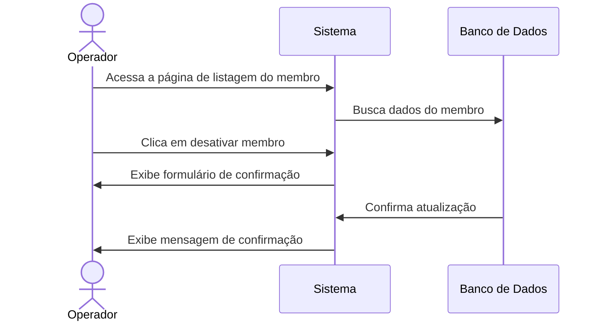

# 🚫 RF07 - Desativar Membro

{ width=150 }

## 📝 Descrição

Esta funcionalidade permite que o operador desative um membro no sistema Quilombo Pena Branca, mantendo seu histórico e dados, mas impedindo que participe ativamente das atividades da comunidade.

## 👑 Atores

- Administrador do sistema
- Operador

## ⚠️ Pré-condições

- O operador deve estar autenticado no sistema
- O membro a ser desativado deve estar atualmente ativo no sistema
- O membro deve estar cadastrado no sistema

## 🔌 Endpoints

- `DELETE /quilombo-api/member/{id}`

## 📋 Dados da Desativação

| Campo      | Tipo      | Obrigatório | Descrição              | Restrições              |
|------------|-----------|-------------|------------------------|-------------------------|
| `id`       | `integer` | ✅ Sim       | ID do membro           | Deve existir no sistema |

## 🔄 Fluxo Principal



1. O operador acessa a página de listagem de membros
2. O operador clica no botão "Desativar Membro".
3. O sistema apresenta um formulário de confirmação.
4. O sistema valida os dados informados.
5. O sistema altera o status do membro para inativo e registra a data da desativação.
6. O sistema volta a exibir a lista com os membros, agora com o membro desativado.

## 🔀 Fluxos Alternativos

### ⚠️ F01- Dados inválidos

1. No passo 6 do fluxo principal, o sistema identifica dados inválidos 
2. O sistema exibe mensagens específicas para cada erro encontrado.
3. O formulário continua aberto para correção.

## 🧪 Exemplo de Requisição

### Requisição HTTP
```http
PATCH /quilombo-api/member/42/deactivate HTTP/1.1
Host: api.quilombopenabranca.org
Content-Type: application/json
Authorization: Bearer {token}

{
  "reason": "Mudança de residência para outro estado",
  "comments": "Membro solicitou desativação temporária até retorno à comunidade",
  "date": "2023-07-15"
}
```


## 🖼️ Interface de Confirmação


## ⚠️ Impactos da Desativação

Quando um membro é desativado no sistema:

- 🚫 Não aparece nas listagens padrão de membros ativos
- 📝 Permanece nos registros históricos e relatórios completos
- 🔒 Mantém todo seu histórico de obrigações e informações
- 🔄 Pode ser reativado posteriormente por um operador autorizado
- 👑 Tem seus cargos mantidos mas marcados como inativos

---


> ---------------------------------------------------------------------------
> #### 🌙 Quilombo Pena Branca 🌙
> ***Honrando nossas raízes, construindo nosso futuro***
> ---------------------------------------------------------------------------