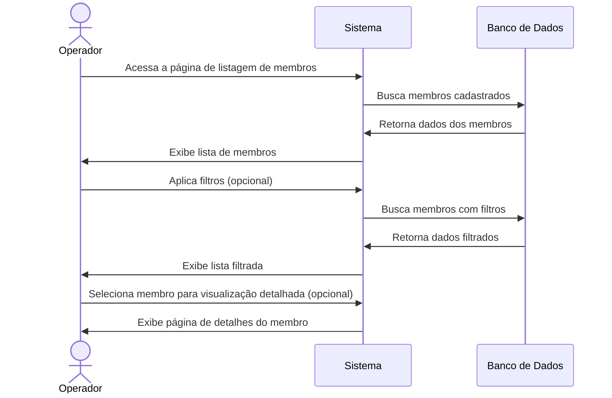
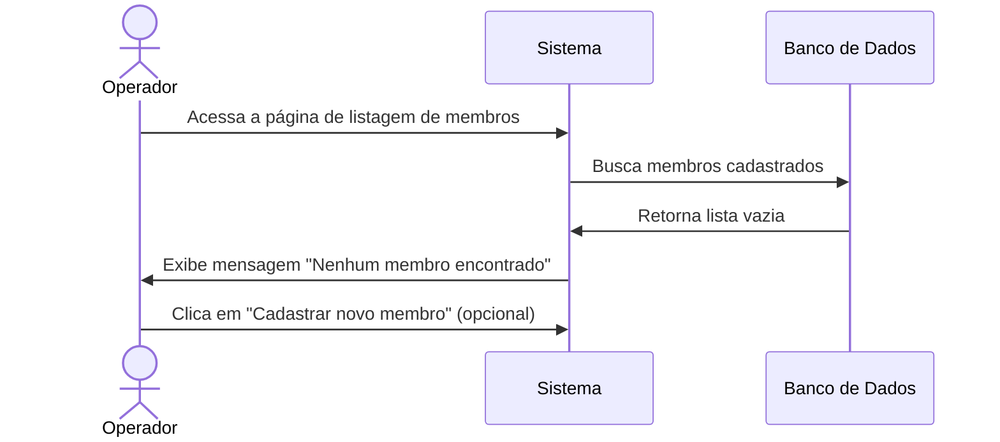

# 📋 RF08 - Listar Membros

{ width=150 }

## 📝 Descrição

Esta funcionalidade permite que o operador visualize e filtre todos os membros cadastrados no sistema Quilombo Pena Branca, facilitando a busca e consulta de informações.

## 👑 Atores

- Administrador do sistema
- Operador

## ⚠️ Pré-condições

- O operador deve estar autenticado no sistema
- O operador deve ter permissão para visualizar a lista de membros

## 🔌 Endpoints

- `GET /quilombo-api/member`

## 📋 Parâmetros de Consulta

| Campo       | Tipo      | Obrigatório | Descrição                      | Exemplo               |
|-------------|-----------|-------------|--------------------------------|-----------------------|
| `name`      | `string`  | ❌ Não       | Nome para filtrar membros      | `?name=Silva`         |
| `status`    | `string`  | ❌ Não       | Status do membro               | `?status=active`      |
| `position`  | `integer` | ❌ Não       | ID do cargo para filtrar       | `?position=3`         |
| `page`      | `integer` | ❌ Não       | Página da listagem             | `?page=1`             |
| `size`      | `integer` | ❌ Não       | Quantidade de itens por página | `?size=20`            |

## 🔄 Fluxo Principal



1. O operador acessa a página de listagem de membros.
2. O sistema exibe uma tabela com todos os membros cadastrados, exibindo informações resumidas.
3. O operador pode filtrar a lista por nome, CPF, status ou cargo.
4. O operador pode ordenar a lista por diferentes campos (nome, data de entrada, etc.).
5. O operador pode navegar entre as páginas da listagem.
6. O operador pode selecionar um membro específico para visualizar detalhes completos.
7. O operador pode exportar a lista de membros em formato PDF ou Excel.

## 🔀 Fluxos Alternativos

### ⚠️ F01 - Nenhum membro encontrado



1. No passo 2 do fluxo principal, o sistema não encontra nenhum membro cadastrado.
2. O sistema exibe uma mensagem informando que não há membros cadastrados.
3. O sistema oferece a opção de cadastrar um novo membro.

### ⚠️ F02 - Nenhum resultado para os filtros aplicados

1. No passo 3 do fluxo principal, o operador aplica filtros que não retornam resultados.
2. O sistema exibe uma mensagem informando que nenhum membro foi encontrado com os filtros aplicados.
3. O sistema oferece a opção de limpar os filtros.

## 📊 Resposta da API

### Resposta de Sucesso
```http
HTTP/1.1 200 OK
Content-Type: application/json

{
  "content": [
    {
      "id": 1,
      "name": "Maria da Silva",
      "status": "active",
      "positions": ["Ogã", "Secretário"]
    },
    {
      "id": 2,
      "name": "João Oliveira",
      "status": "inactive",
      "positions": ["Tesoureiro"]
    }
    // ... mais membros
  ],
  "pageable": {
    "pageNumber": 0,
    "pageSize": 20,
    "totalElements": 42,
    "totalPages": 3
  }
}
```

## 🖼️ Interface da Listagem


## 🔍 Recursos da Interface

- **🔍 Barra de busca** para pesquisas rápidas por nome ou CPF
- **⚙️ Filtros avançados** com opções para refinar a busca
- **📊 Ordenação** por colunas clicáveis
- **📱 Visualização responsiva** adaptada para dispositivos móveis
- **📄 Exportação** para formatos PDF e Excel
- **🔢 Paginação** com opções para definir itens por página
- **🎨 Indicadores visuais** para status de membro (ativo/inativo)
- **👑 Ícones de cargo** para identificação rápida

---


> ---------------------------------------------------------------------------
> #### 🌙 Quilombo Pena Branca 🌙
> ***Honrando nossas raízes, construindo nosso futuro***
> ---------------------------------------------------------------------------

