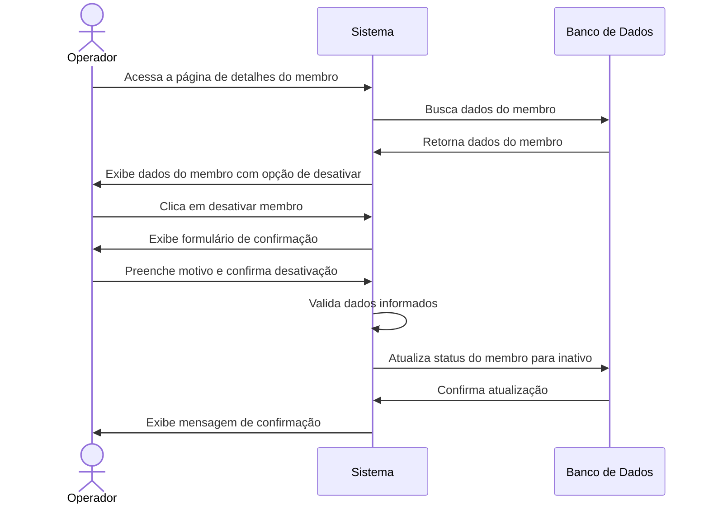
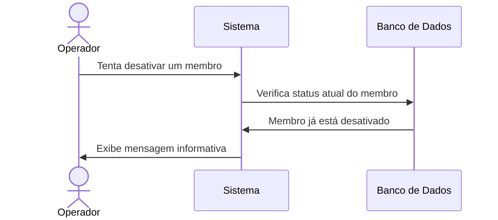

# 🚫 RF08 - Desativar Membro

{ width=150 }

## 📝 Descrição

Esta funcionalidade permite que o operador desative um membro no sistema Quilombo Pena Branca, mantendo seu histórico e dados, mas impedindo que participe ativamente das atividades da comunidade.

## 👑 Atores

- Administrador do sistema
- Operador

## ⚠️ Pré-condições

- O operador deve estar autenticado no sistema
- O membro a ser desativado deve estar atualmente ativo no sistema
- O membro deve estar cadastrado no sistema

## 🔌 Endpoints

- `PATCH /api/v1/members/{id}/deactivate`

## 📋 Dados da Desativação

| Campo      | Tipo      | Obrigatório | Descrição              | Restrições              |
|------------|-----------|-------------|------------------------|-------------------------|
| `id`       | `integer` | ✅ Sim       | ID do membro           | Deve existir no sistema |
| `reason`   | `string`  | ✅ Sim       | Motivo da desativação  | Mínimo de 5 caracteres  |
| `comments` | `string`  | ❌ Não       | Comentários adicionais | -                       |
| `date`     | `date`    | ✅ Sim       | Data da desativação    | Formato YYYY-MM-DD      |

## 🔄 Fluxo Principal



1. O operador acessa a página de detalhes do membro que deseja desativar.
2. O sistema exibe os dados do membro com a opção de desativação.
3. O operador clica no botão "Desativar Membro".
4. O sistema apresenta um formulário de confirmação solicitando o motivo da desativação.
5. O operador preenche o motivo da desativação e confirma a ação.
6. O sistema valida os dados informados.
7. O sistema altera o status do membro para inativo e registra o motivo da desativação.
8. O sistema exibe uma mensagem de confirmação da desativação.

## 🔀 Fluxos Alternativos

### ⚠️ F01 - Membro já desativado



1. No passo 2 do fluxo principal, o sistema verifica que o membro já está desativado.
2. O sistema exibe uma mensagem informando que o membro já está desativado.
3. A operação é cancelada.

### ⚠️ F02 - Dados inválidos

1. No passo 6 do fluxo principal, o sistema identifica dados inválidos (motivo muito curto ou em branco).
2. O sistema exibe mensagens específicas para cada erro encontrado.
3. O formulário continua aberto para correção.

## 🧪 Exemplo de Requisição

### Requisição HTTP
```http
PATCH /api/v1/members/42/deactivate HTTP/1.1
Host: api.quilombopenabranca.org
Content-Type: application/json
Authorization: Bearer {token}

{
  "reason": "Mudança de residência para outro estado",
  "comments": "Membro solicitou desativação temporária até retorno à comunidade",
  "date": "2023-07-15"
}
```

### Resposta de Sucesso
```http
HTTP/1.1 200 OK
Content-Type: application/json

{
  "id": 42,
  "name": "Maria da Silva",
  "status": "inactive",
  "deactivationDate": "2023-07-15",
  "deactivationReason": "Mudança de residência para outro estado"
}
```

## 🖼️ Interface de Confirmação


## ⚠️ Impactos da Desativação

Quando um membro é desativado no sistema:

- 🚫 Não aparece nas listagens padrão de membros ativos
- 📝 Permanece nos registros históricos e relatórios completos
- 🔒 Mantém todo seu histórico de obrigações e informações
- 🔄 Pode ser reativado posteriormente por um operador autorizado
- 👑 Tem seus cargos mantidos mas marcados como inativos

---

  #### 🌙 Quilombo Pena Branca 🌙
  ***Honrando nossas raízes, construindo nosso futuro***
