# 🔑 RF9 - Logar Operador

{ width=150 }

## 📝 Descrição

Este requisito funcional permite que os operadores realizem login no sistema Quilombo Pena Branca, garantindo acesso seguro às funcionalidades de acordo com suas permissões. O processo de autenticação assegura que apenas usuários autorizados possam acessar o sistema.

## 👑 Atores

- Administrador do sistema
- Operador

## ✅ Pré-condições

- O operador deve estar previamente cadastrado no sistema
- O operador deve possuir status ativo
- O sistema deve estar disponível e acessível

## 🌐 Endpoint

- `POST /quilombo-api/authenticate`

## 📊 Dados do Login

| Campo    | Tipo   | Obrigatório | Restrições             |
|----------|--------|-------------|------------------------|
| nome     | String | ✓           | Mínimo de 3 caracteres |
| password | String | ✓           | Mínimo de 8 caracteres |

## 🔄 Fluxo Principal

```mermaid
sequenceDiagram
    participant O as Operador
    participant S as Sistema
    participant DB as Banco de Dados
    
    O->>S: Acessa a página de login
    S->>O: Exibe formulário de login
    O->>S: Preenche nome e senha
    O->>S: Clica no botão "Entrar"
    S->>DB: Valida credenciais
    DB->>S: Retorna dados do operador
    S->>S: Gera token JWT
    S->>O: Redireciona para a página inicial
    S->>O: Exibe mensagem de boas-vindas
```



## 🔀 Fluxos Alternativos

### 1. nome e/ou senha incorretos

```mermaid
sequenceDiagram
    participant O as Operador
    participant S as Sistema
    participant DB as Banco de Dados
    
    O->>S: Preenche nome e/ou senha incorretos
    O->>S: Clica no botão "Entrar"
    S->>DB: Valida credenciais
    DB->>S: Retorna erro de autenticação
    S->>O: Exibe mensagem "nome ou senha incorretos"
    S->>O: Mantém na página de login
```



### 2. Operador inativo

```mermaid
sequenceDiagram
    participant O as Operador
    participant S as Sistema
    participant DB as Banco de Dados
    
    O->>S: Preenche nome e senha
    O->>S: Clica no botão "Entrar"
    S->>DB: Valida credenciais
    DB->>S: Retorna status inativo
    S->>O: Exibe mensagem "Conta desativada, contate o administrador"
    S->>O: Mantém na página de login
```




## 📄 Exemplo de Requisição HTTP

```http
POST /quilombo-api/auth/login HTTP/1.1
Host: api.quilombopenabranca.org
Content-Type: application/json

{
  "nome": "arthur",
  "password": "senha@123"
}
```

## 📄 Exemplo de Resposta (Sucesso)

```json
{
  "token": "eyJhbGciOiJIUzI1NiIsInR5cCI6IkpXVCJ9...",
  "expiresIn": 3600
}
```

## 🖼️ Interface de Referência


## 🔒 Considerações de Segurança

- O sistema deve armazenar apenas o hash das senhas, nunca as senhas em texto puro
- As senhas devem ser transmitidas através de conexão HTTPS
- Tentativas consecutivas de login malsucedidas devem resultar em bloqueio temporário da conta
- O token JWT gerado deve ter tempo de expiração configurável
- Todos os acessos (bem-sucedidos ou não) devem ser registrados para fins de auditoria

---

> ---------------------------------------------------------------------------
> #### 🌙 Quilombo Pena Branca 🌙
> ***Honrando nossas raízes, construindo nosso futuro***
> ---------------------------------------------------------------------------