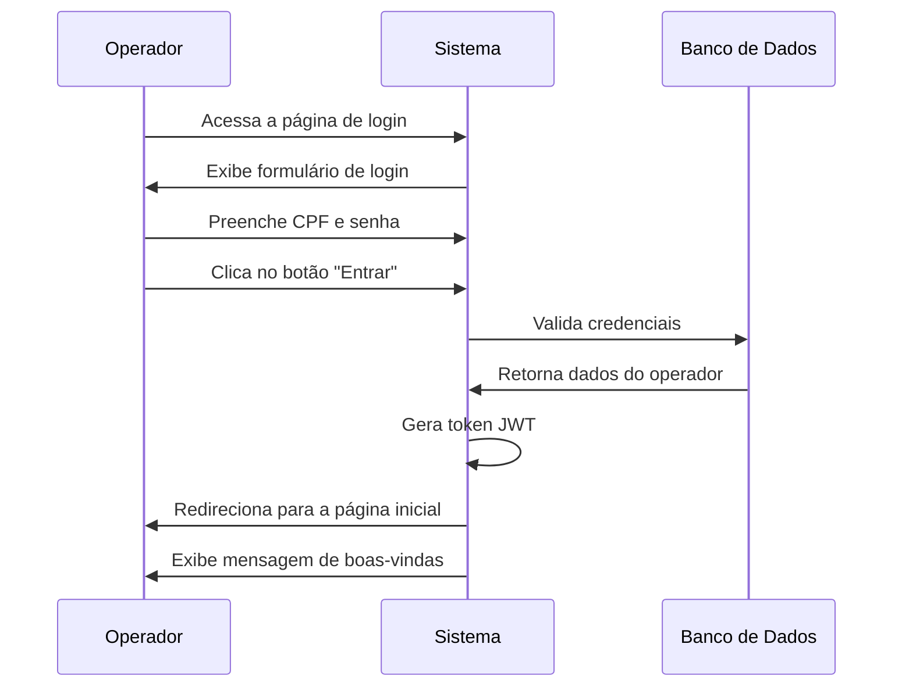
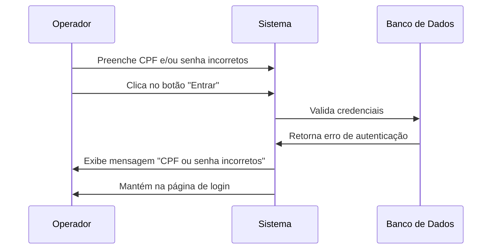
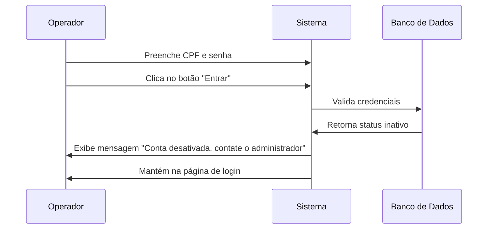
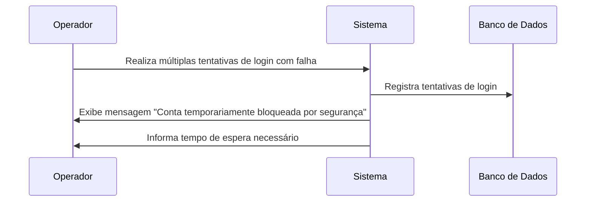

# 🔑 RF10 - Logar Operador

{ width=150 }

## 📝 Descrição

Este requisito funcional permite que os operadores realizem login no sistema Quilombo Pena Branca, garantindo acesso seguro às funcionalidades de acordo com suas permissões. O processo de autenticação assegura que apenas usuários autorizados possam acessar o sistema.

## 👑 Atores

- Administrador do sistema
- Operador

## ✅ Pré-condições

- O operador deve estar previamente cadastrado no sistema
- O operador deve possuir status ativo
- O sistema deve estar disponível e acessível

## 🌐 Endpoint

- `POST /api/v1/auth/login`

## 📊 Dados do Login

| Campo    | Tipo   | Obrigatório | Restrições                         |
|----------|--------|-------------|-----------------------------------|
| cpf      | String | ✓           | Formato válido: XXX.XXX.XXX-XX    |
| password | String | ✓           | Mínimo de 8 caracteres            |

## 🔄 Fluxo Principal



## 🔀 Fluxos Alternativos

### 1. CPF e/ou senha incorretos



### 2. Operador inativo



### 3. Bloqueio temporário por tentativas excessivas



## 📄 Exemplo de Requisição HTTP

```http
POST /api/v1/auth/login HTTP/1.1
Host: api.quilombopenabranca.org
Content-Type: application/json

{
  "cpf": "123.456.789-00",
  "password": "senha@123"
}
```

## 📄 Exemplo de Resposta (Sucesso)

```json
{
  "token": "eyJhbGciOiJIUzI1NiIsInR5cCI6IkpXVCJ9...",
  "refreshToken": "eyJhbGciOiJIUzI1NiIsInR5cCI6IkpXVCJ9...",
  "user": {
    "id": 42,
    "name": "João Silva",
    "cpf": "123.456.789-00",
    "isAdmin": true,
    "status": "ACTIVE",
    "lastLogin": "2023-05-20T15:30:45Z"
  },
  "expiresIn": 3600
}
```

## 🖼️ Interface de Referência


## 🔒 Considerações de Segurança

- O sistema deve armazenar apenas o hash das senhas, nunca as senhas em texto puro
- As senhas devem ser transmitidas através de conexão HTTPS
- Tentativas consecutivas de login malsucedidas devem resultar em bloqueio temporário da conta
- O token JWT gerado deve ter tempo de expiração configurável
- Todos os acessos (bem-sucedidos ou não) devem ser registrados para fins de auditoria

---

  #### 🌙 Quilombo Pena Branca 🌙
  Honrando nossas raízes, construindo nosso futuro