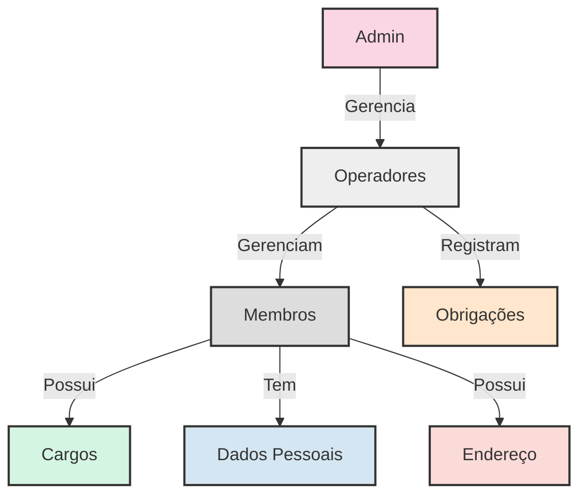
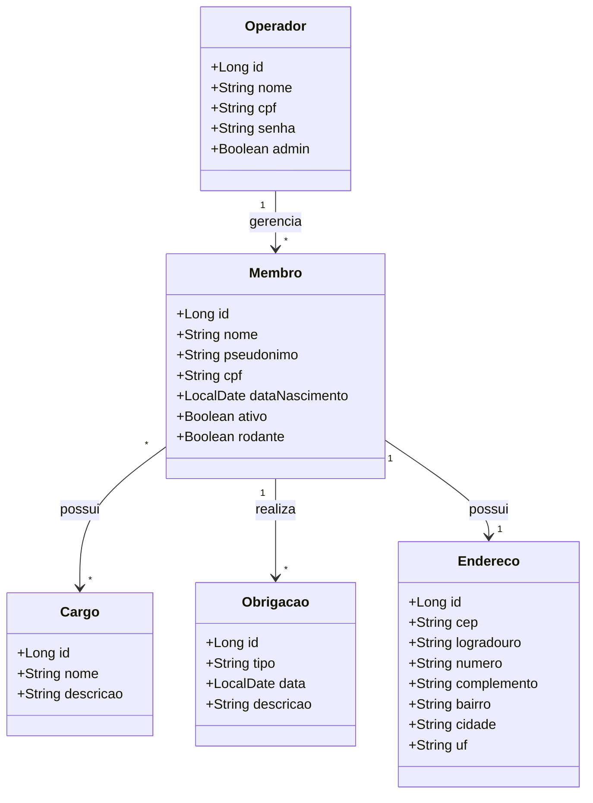

# 📋 Requisitos do Sistema

## 🚀 Requisitos Funcionais

| Cod. | Nome                              | Ator     | Objetivo                                            | Status |
|------|-----------------------------------|----------|-----------------------------------------------------|--------|
| RF01 | 👤 Cadastrar Operador             | Admin    | O admin criará um operador no sistema               | ✅      |
| RF02 | ✏️ Editar Operador                | Admin    | O admin editará um operador                         | ✅      |
| RF03 | 🗑️ Excluir Operador              | Admin    | O admin excluirá um operador                        | ✅      |
| RF04 | 📋 Listar Operadores              | Admin    | O admin visualizará todos os operadores cadastrados | ✅      |
| RF05 | 👥 Cadastrar Membro               | Operador | O operador cadastrará um membro                     | ✅      |
| RF06 | ✏️ Editar Membro                  | Operador | O operador editará um membro                        | ✅      |
| RF07 | 🚫 Desativar Membro               | Operador | O operador desativará um membro                     | ✅      |
| RF08 | 📋 Listar Membros                 | Operador | O operador visualizará todos os membros cadastrados | ✅      |
| RF09 | 🔑 Logar Operador                 | Operador | O operador fará login no sistema                    | ✅      |
| RF10 | 🚪 Deslogar Operador              | Operador | O operador fará logout do sistema                   | ✅      |
| RF11 | 📝 Cadastrar Obrigação            | Operador | O operador registrará obrigações religiosas         | ✅      |
| RF12 | 📋 Listar e Consultar Obrigações  | Operador | O operador visualizará as obrigações registradas    | ✅      |
| RF13 | 🔑 Alterar Senha                  | Operador | O operador e admin poderão alterar senhas           | ✅      |
| RF14 | 📍 Consultar Endereço por CEP     | Operador | O operador buscará endereço a partir do CEP         | ✅      |

## 🛠️ Requisitos Não Funcionais

| Cod.  | Nome               | Objetivo                                         | Status |
|-------|--------------------|--------------------------------------------------|--------|
| RNF01 | 🔒 Segurança       | O sistema deve garantir a segurança dos dados    | ✅      |
| RNF02 | 🧠 Usabilidade     | O sistema deve ser de fácil utilização           | ✅      |
| RNF03 | ⏱️ Disponibilidade | O sistema deve estar disponível 24 horas por dia | ✅      |
| RNF04 | ⚡ Performance      | O sistema deve ser rápido e responsivo           | ✅      |

## 📊 Diagrama de Fluxo de Trabalho

## 🔗 Relacionamentos

- 👑 **Admin** gerencia múltiplos **Operadores**
- 👤 **Operadores** gerenciam múltiplos **Membros**
- 📝 **Operadores** registram **Obrigações** para os **Membros**
- 🏅 **Membros** podem possuir um ou mais **Cargos**
- 📍 **Membros** possuem um **Endereço**

## 🗃️ Estrutura de Dados Principal

---

> ---------------------------------------------------------------------------
> #### 🌙 Quilombo Pena Branca 🌙
> ***Honrando nossas raízes, construindo nosso futuro***
> ---------------------------------------------------------------------------
