# 📋 Requisitos do Sistema

## 🚀 Requisitos Funcionais

| Cod. | Nome                             | Ator     | Objetivo                                            | Status |
|------|----------------------------------|----------|-----------------------------------------------------|--------|
| RF01 | 👤 Cadastrar Operador            | Admin    | O admin criará um operador no sistema               | ✅     |
| RF02 | ✏️ Editar Operador               | Admin    | O admin editará um operador                         | ✅     |
| RF03 | 🗑️ Excluir Operador              | Admin    | O admin excluirá um operador                        | ✅     |
| RF04 | 📋 Listar Operadores             | Admin    | O admin visualizará todos os operadores cadastrados | ✅     |
| RF05 | 🔍 Detalhar Operador             | Admin    | O admin visualizará os detalhes de um operador      | ✅     |
| RF06 | 👥 Cadastrar Membro              | Operador | O operador cadastrará um membro                     | ✅     |
| RF07 | ✏️ Editar Membro                 | Operador | O operador editará um membro                        | ✅     |
| RF08 | 🚫 Desativar Membro              | Operador | O operador desativará um membro                     | ✅     |
| RF09 | 📋 Listar Membros                | Operador | O operador visualizará todos os membros cadastrados | ✅     |
| RF10 | 🔑 Logar Operador                | Operador | O operador fará login no sistema                    | ✅     |
| RF11 | 🚪 Deslogar Operador             | Operador | O operador fará logout do sistema                   | ✅     |
| RF12 | 📝 Cadastrar Obrigação           | Operador | O operador registrará obrigações religiosas         | ✅     |
| RF13 | 📋 Listar e Consultar Obrigações | Operador | O operador visualizará as obrigações registradas    | ✅     |
| RF14 | ✏️🗑️ Editar e Excluir Obrigações | Operador | O operador modificará ou excluirá obrigações        | ✅     |
| RF15 | 🔑 Alterar Senha                 | Operador | O operador e admin poderão alterar senhas           | ✅     |
| RF16 | 📍 Consultar Endereço por CEP    | Operador | O operador buscará endereço a partir do CEP         | ✅     |
| RF17 | 👑 Promover Usuário a Admin      | Admin    | O admin promoverá um operador a administrador       | ✅     |

## 🛠️ Requisitos Não Funcionais

| Cod.  | Nome              | Objetivo                                         | Status |
|-------|-------------------|--------------------------------------------------|--------|
| RNF01 | 🔒 Segurança       | O sistema deve garantir a segurança dos dados    | ✅     |
| RNF02 | 🧠 Usabilidade     | O sistema deve ser de fácil utilização           | ✅     |
| RNF03 | ⏱️ Disponibilidade | O sistema deve estar disponível 24 horas por dia | ✅     |
| RNF04 | ⚡ Performance     | O sistema deve ser rápido e responsivo           | ✅     |

## 📊 Diagrama de Fluxo de Trabalho

```mermaid
flowchart TD
    A[Admin] -->|Gerencia| B[Operadores]
    B -->|Gerenciam| C[Membros]
    B -->|Registram| D[Obrigações]
    C -->|Possui| E[Cargos]
    C -->|Tem| F[Dados Pessoais]
    C -->|Possui| G[Endereço]
    style A fill:#f9d5e5,stroke:#333,stroke-width:2px
    style B fill:#eeeeee,stroke:#333,stroke-width:2px
    style C fill:#dddddd,stroke:#333,stroke-width:2px
    style D fill:#ffe6cc,stroke:#333,stroke-width:2px
    style E fill:#d5f5e3,stroke:#333,stroke-width:2px
    style F fill:#d4e6f1,stroke:#333,stroke-width:2px
    style G fill:#fadbd8,stroke:#333,stroke-width:2px
```

## 🔗 Relacionamentos

- 👑 **Admin** gerencia múltiplos **Operadores**
- 👤 **Operadores** gerenciam múltiplos **Membros**
- 📝 **Operadores** registram **Obrigações** para os **Membros**
- 🏅 **Membros** podem possuir um ou mais **Cargos**
- 📍 **Membros** possuem um **Endereço**

## 🗃️ Estrutura de Dados Principal

---

  <h3>🌙 Quilombo Pena Branca 🌙</h3>
  
Desenvolvido com ❤️ pela Senzalla Technology

